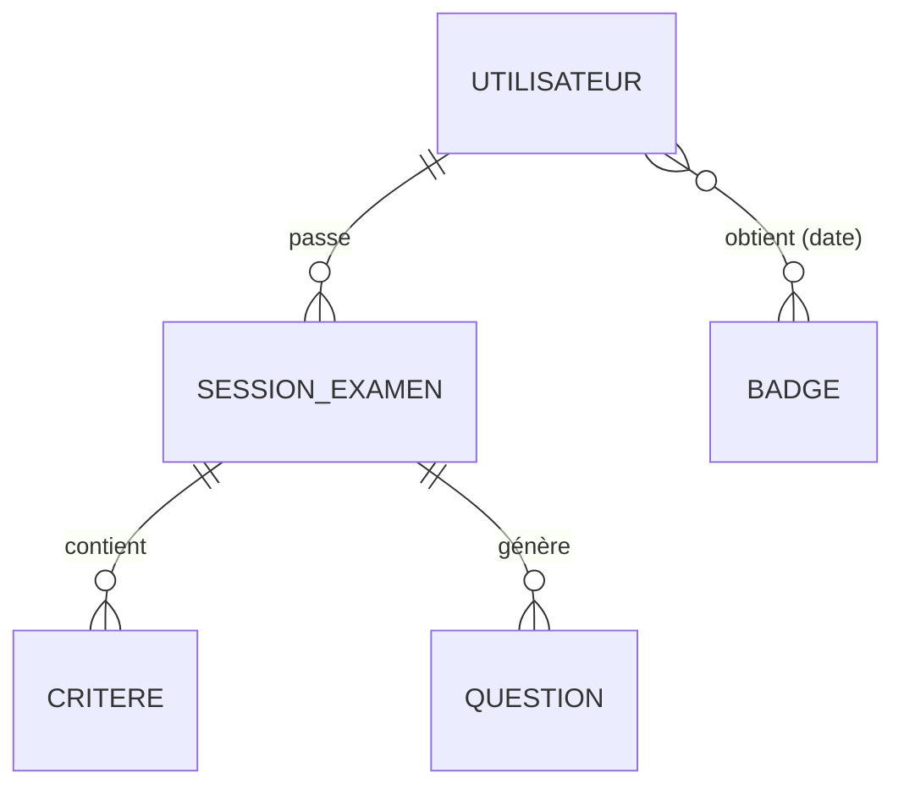
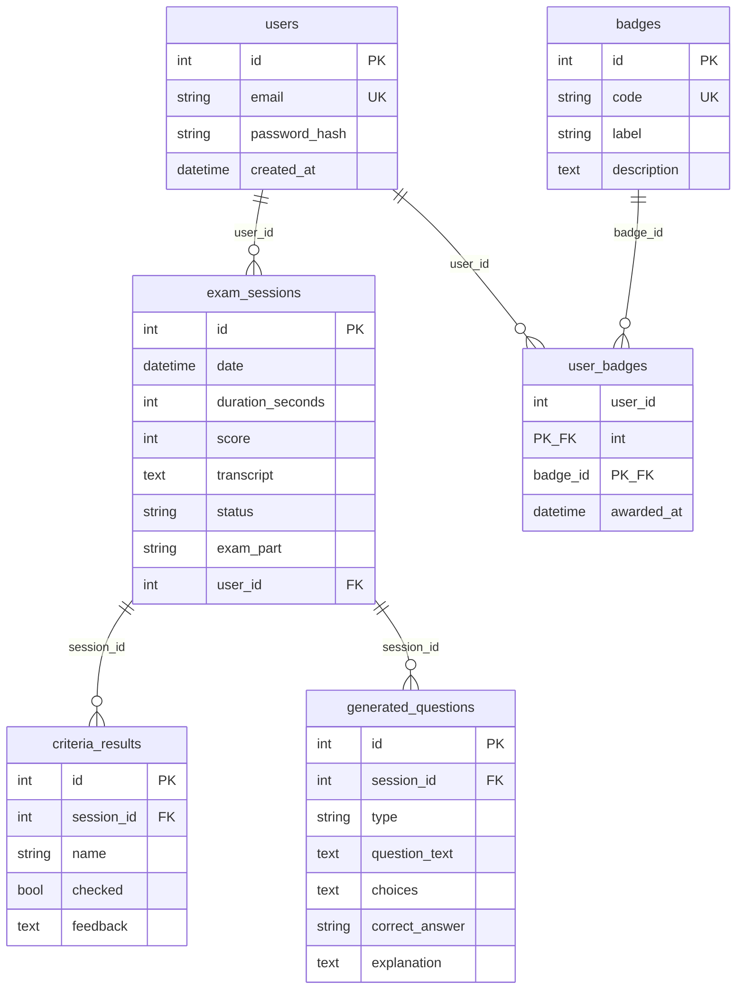

# Modèle de données — MCD / MLD

Ce document décrit le modèle de données du Simulateur DWWM, cohérent avec le schéma
réel défini dans [`backend/app/db/sqlite.py`](../backend/app/db/sqlite.py).

## 1. MCD — Modèle Conceptuel de Données

Entités et associations (niveau conceptuel) :

- **UTILISATEUR** *passe* **SESSION D'EXAMEN** — un utilisateur passe plusieurs sessions ; une session appartient à un seul utilisateur (**1,N**).
- **SESSION D'EXAMEN** *contient* **CRITÈRE** — une session comporte plusieurs résultats de critères (**1,N**).
- **SESSION D'EXAMEN** *génère* **QUESTION** — une session génère plusieurs questions (**1,N**).
- **UTILISATEUR** *obtient* **BADGE** — un utilisateur peut obtenir plusieurs badges, et un badge peut être obtenu par plusieurs utilisateurs (**N,N**, porteuse de la date d'obtention).



## 2. MLD — Modèle Logique de Données

Passage au relationnel : l'association N:N `obtient` devient la table de jonction
`user_badges` (clé primaire composite `user_id, badge_id` garantissant l'intégrité).



## 3. Schéma DBML (import [dbdiagram.io](https://dbdiagram.io))

```dbml
Table users {
  id integer [pk, increment]
  email varchar [unique, not null]
  password_hash varchar [not null]
  created_at datetime
}

Table exam_sessions {
  id integer [pk, increment]
  date datetime
  duration_seconds integer
  score integer
  transcript text
  status varchar
  exam_part varchar
  user_id integer [ref: > users.id]
}

Table criteria_results {
  id integer [pk, increment]
  session_id integer [ref: > exam_sessions.id]
  name varchar
  checked boolean
  feedback text
}

Table generated_questions {
  id integer [pk, increment]
  session_id integer [ref: > exam_sessions.id]
  type varchar
  question_text text
  choices text
  correct_answer varchar
  explanation text
}

Table badges {
  id integer [pk, increment]
  code varchar [unique, not null]
  label varchar [not null]
  description text
}

Table user_badges {
  user_id integer [ref: > users.id]
  badge_id integer [ref: > badges.id]
  awarded_at datetime
  indexes {
    (user_id, badge_id) [pk]
  }
}
```

## 4. Contraintes d'intégrité

- **Clés primaires** : `id` auto-incrémenté sur chaque table (sauf `user_badges` : clé composite `(user_id, badge_id)`).
- **Clés étrangères** : `exam_sessions.user_id → users.id`, `criteria_results.session_id → exam_sessions.id`, `generated_questions.session_id → exam_sessions.id`, `user_badges.user_id → users.id`, `user_badges.badge_id → badges.id`.
- **Unicité** : `users.email`, `badges.code`.
- **Intégrité de la relation N:N** : la clé primaire composite de `user_badges` interdit qu'un utilisateur obtienne deux fois le même badge.
- **Suppression en cascade** : `user_badges` référence `users` et `badges` avec `ON DELETE CASCADE` ; les `criteria_results` et `generated_questions` sont supprimés avec leur session (cascade ORM).
